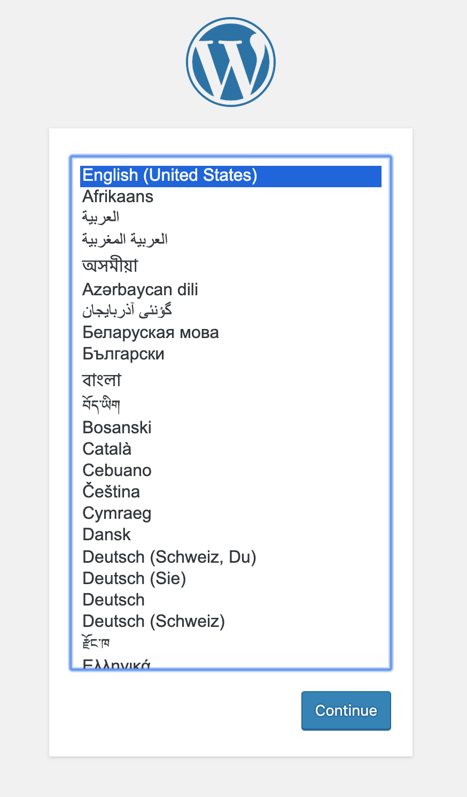

# Wordpress in Okteto

Run a Wordpress instance directly in [Okteto Cloud](https://cloud.okteto.com)

> This is adapted from the sample available at https://kubernetes.io/docs/tutorials/stateful-application/mysql-wordpress-persistent-volume/

1. Login to https://cloud.okteto.com
1. Download your Kubernetes credentials by clicking on the `Credentials` button in the far left of the screen.
1. On a terminal shell, set the `KUBECONFIG` env var to the location of the downloaded credentials credentials. 
        export KUBECTL=$HOME/Downloads/okteto-kube.config
1. Clone this repo
```
git clone git@github.com:rberrelleza/wordpress-in-okteto.git
```

5. Apply the manifests.
        
```
kubectl apply -k ./
```

```
secret/mysql-pass-c57bb4t7mf created
service/wordpress-mysql created
deployment.apps/wordpress-mysql created
deployment.apps/wordpress created
persistentvolumeclaim/mysql-pv-claim created
persistentvolumeclaim/wp-pv-claim created
```

6. Wait for the deployments to rollout correctly.

```
kubectl rollout status deployment wordpress
```

```
deployment "wordpress" successfully rolled out
```

7. Go back to https://cloud.okteto.com in your browser and click on the endpoint of your Wordpress instance.


8.You'll  see a WordPress set up page similar to one below.


> Do not leave your WordPress installation on this page. If other person finds it, they can set up a website on your instance and use it to serve malicious content. Finish the installation by creating a username and password or delete your instance.

## How does it work?

I made two changes to [the sample deployments](https://kubernetes.io/docs/tutorials/stateful-application/mysql-wordpress-persistent-volume/) to make it work in Okteto Cloud. 

1. Change the service type from `LoadBalancer` to ClusterIP [on the `wordpress` service](wordpress-deployment.yaml#L15). Okteto Cloud doesn't support the LoadBalancer service type. Instead,it uses ClusterIP and automatically configures the internal network and creates the necessary  endpoints for your application.

1. Add the `dev.okteto.com/auto-ingress: "true"` [annotation to the `wordpress` service](wordpress-deployment.yaml#L6). This instructs Okteto Cloud to create a public HTTPS endpoint for the `wordpress` service. The URL of the endpoint is displayed in the Okteto Cloud UI. With this, you can access your Wordpress instance directly through the public network, just as your users would.


